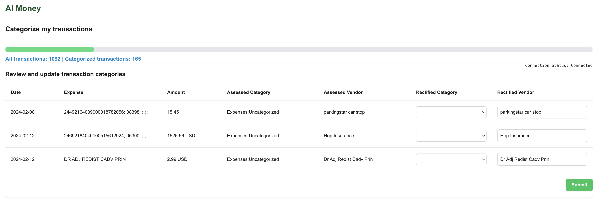

## AI Money

This is a personal finance expense tracker. This works on top of transactions in [beancount](https://beancount.github.io/) file format.
The app converts an uploaded csv of credit card statement into a beacnount file and categorizes the expenses with an AI agent.

### Features
- Categorize transactions using AI



### Setup

#### Backend
- Install the python version specified in pyproject.toml
- cd backend
- pip install poetry
- poetry install

#### Frontend
This is a [Next.js](https://nextjs.org) app bootstrapped with [`create-next-app`](https://nextjs.org/docs/app/api-reference/cli/create-next-app).

Install
- Node.js (version 22.x or later recommended)
- npm (comes with Node.js)
- cd frontend
- npm install

### Run

**Backend**

## To build and run the application:

1. Install dependencies:
```bash
cd backend
poetry shell
poetry install
```

2. Run the server:
```bash
ANTHROPIC_API_KEY=<your_key> poetry run uvicorn app:app --reload
```

## Build and run the application using Docker:

Build the Docker image:
```bash
docker build -t ai-money-backend .
```

Test locally:
```bash
docker run -p 8000:8000 -e ANTHROPIC_API_KEY=your_key ai-money-backend
```

### AWS Deployment

```
docker build --platform=linux/amd64 -t ai-money/backend:`git log -n 1 --format="%H"` .
docker tag ai-money/backend:`git log -n 1 --format="%H"` 867344451303.dkr.ecr.us-west-2.amazonaws.com/ai-money/backend:`git log -n 1 --format="%H"`
docker push 867344451303.dkr.ecr.us-west-2.amazonaws.com/ai-money/backend:`git log -n 1 --format="%H"`
```


**Frontend**

## To build and run the application:
```
cd frontend
npm run dev
```

And visit localhost:3000


## Build and run the application using Docker:

```bash
# Build the Docker image
docker build -t ai-money-frontend .

# Run the container
docker run -p 3000:3000 ai-money-frontend
```

### AWS Deployment

```
docker build --platform=linux/amd64 -t ai-money/frontend:`git log -n 1 --format="%H"` .
docker tag ai-money/frontend:`git log -n 1 --format="%H"`  867344451303.dkr.ecr.us-west-2.amazonaws.com/ai-money/frontend:`git log -n 1 --format="%H"`
docker push 867344451303.dkr.ecr.us-west-2.amazonaws.com/ai-money/frontend:`git log -n 1 --format="%H"`
```


**Sample CC statement**

A sample statement is available in backend/statements. Currently, the application supports only this statement format. To use this application, ensure your statements are converted to this CSV format.


### Dashboard

[Paisa](https://paisa.fyi/) is a dashboard tool to visualize the transactions. To visualiase the transactions you can use that.
